# CSE 151A - Taxi ML Group

# Notebooks
- explore_preprocess.ipynb - all of our data exploration and preprocessing
- merge_datasets.ipynb - our notebook where we merged our fare and duration datasets
- model1.ipynb - code for model 1
- model2.ipynb - code for model 2

# Milestone 5 - Writeup

# Introduction

*“Without big data, you are blind and deaf and in the middle of a freeway.” – Geoffrey Moore*

Reliable transportation is a fundamental tool that we take for granted often. We use apps like Uber and Lyft all the time without paying much attention to the way that our trip durations and prices are calculated. With this in mind, our group decided to explore how we could attempt to replicate these calculations using preexisting data from previous taxi fares in New York City. We decided to work with New York City data because of the large amounts of variation with different geographic areas in the US. With a smaller geographical area being covered, our model was more likely to be accurate and less biased for areas that were more populated.

Making this predictive model good is especially important because of its impact on many stakeholders. For passengers, predicting fares and durations  accurately is essential to improve the reliability of their transportation decisions and enhance their trust in ride-hailing services. On a driver level, better predictions would allow them to optimize their routes, maximizing their earnings while spending as little as possible on gas. Even on  a broader city level, New York could use these insights to identify where the most traffic is, which could inform future infrastructure investments. 

What made this problem particularly compelling to us is the complexity of the project. The prediction of taxi fares involves many factors ranging from neighborhood to time of day, each of them interacting in non-linear ways. The duration calculation was an added level of difficulty as it was influenced by unpredictable conditions such as weather, traffic, and special events. These complex challenges demanded an innovative approach that combines data preprocessing, featuring engineering, and advanced machine learning models.

We explored models such as Polynomial Regression, Artificial Neural Networks, and Decision trees to achieve a solution that balances accuracy and generalization. Throughout this report, we outline our methodology, explore the results, and examine the insights gained from this exciting project. 

# Methods

## Data Exploration

Our goal was to predict durations and fares of NYC taxi trips, by creating a model based on a combination of two different datasets. The first dataset contains information released by Google and the NYC Taxi and Limousine Commission, and has around 1.4 million rows with the following features related to the duration of a taxi trip :

- id (Unique identifier for each trip)
- vendor_id (Code indicating trip provider)
- pickup_datetime (Timestamp indicating when trip started)
- dropoff_datetime (Timestamp indicating when trip ended)
- passenger_count (Number of passengers )
- pickup_longitude (Longitude of where trip started )
- pickup_latitude (Latitude of where trip started)
- dropoff_longitude (Longitude of where trip ended)
- dropoff_latitude (Latitude of where trip ended)
- store_and_fwd_flag (Flag indicating whether vehicle had to store trip data locally before forwarding to vendor due to lack of connection)
- passenger_count (Number of passengers)
- trip_duration (Duration of trip in seconds)

The second dataset, released by Google and Coursera, revolves around trip fares and has around 55 million rows of data. The features of this dataset are:

- key (Uniquely identifier for each trip)
- pickup_datetime (Timestamp indicating when trip started)
- pickup_longitude (Longitude of where trip started)
- pickup_latitude (Latitude of where trip started)
- dropoff_longitude (Longitude of where trip ended)
- dropoff_latitude (Longitude of where trip ended)
- passenger_count (Number of passengers)
- fare_amount (Fare in dollars)

We began our exploration of the data by visualizing various characteristics of the two datasets. We started with the Duration dataset, and produced the following figures.

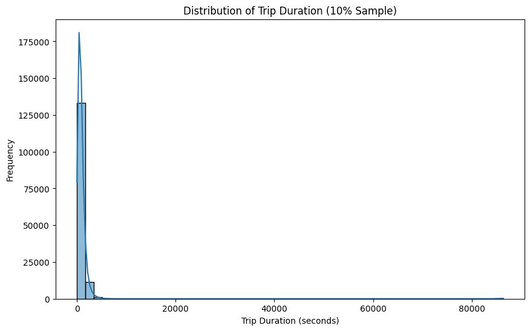

Fig 1. Distribution of Trip Duration; vast majority of trips are short

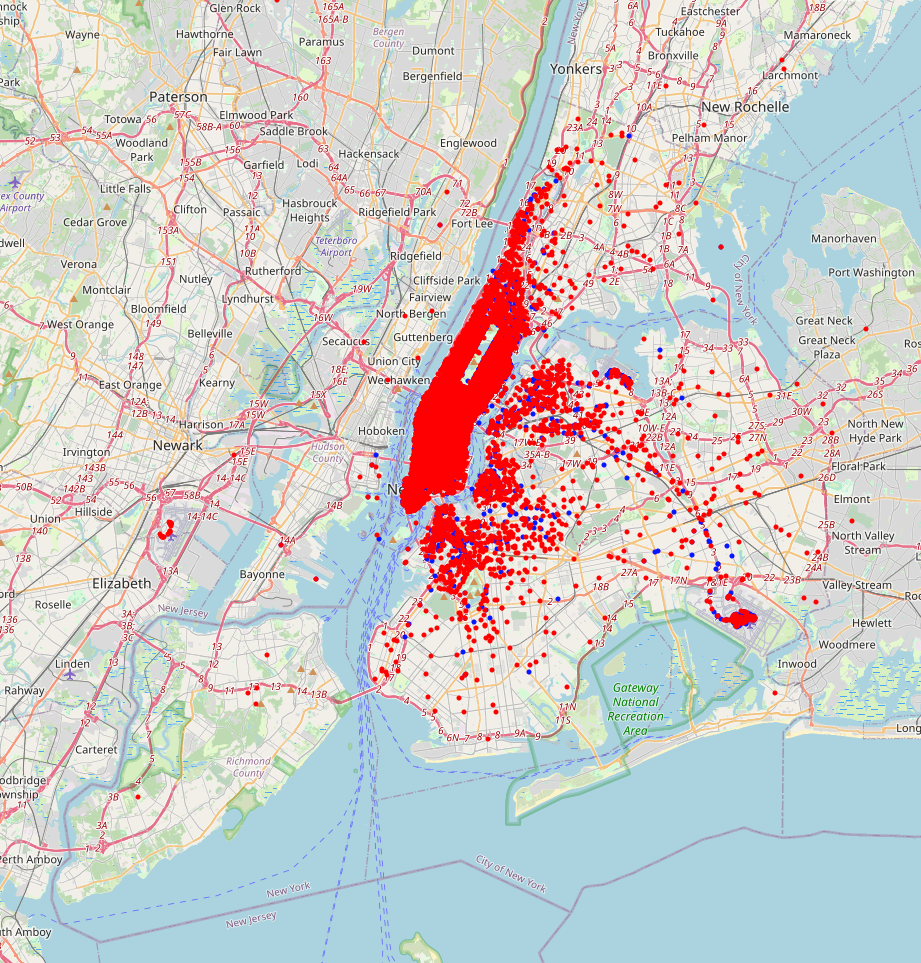

Fig 2. Map of pickups (blue) and dropoffs (red). Both are most densely clustered around Manhattan, which makes sense as Manhattan is the most densely populated of New York’s five boroughs.

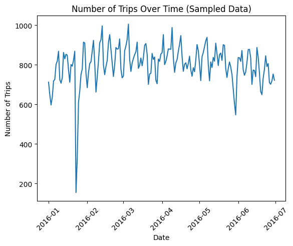

Fig 3. Number of trips taken each month. Sharp decline around January/February, which are the coldest months in NYC.

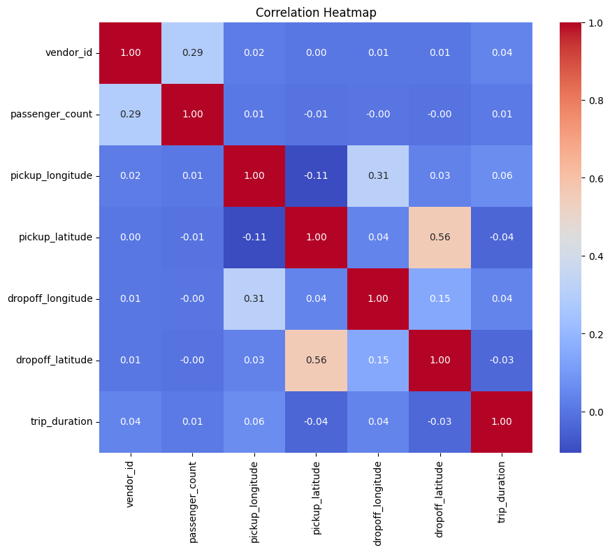

Fig 4. Pairplot of the correlation between features of the Duration dataset. Very little correlation, other pickup/dropoff coordinates.

We also explored the Fare dataset, though we had to take a random sample of 10% of the data points to make working with the massive amount of data less cumbersome.

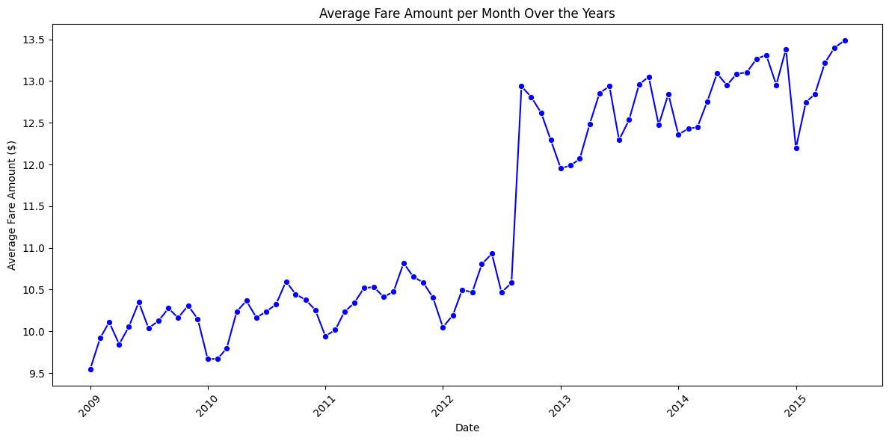

Fig 5. Sharp hike in fare amounts around the middle of 2012, after a vote by the New York Taxi and Limousine Commission.

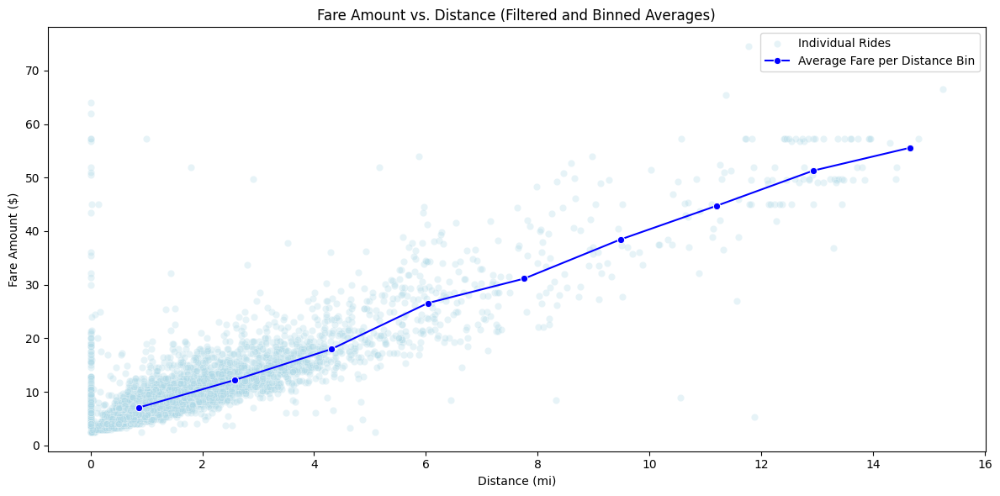

Fig 6. Fare amount vs Distance. As expected, there’s a strong positive correlation between going further and the fare. 

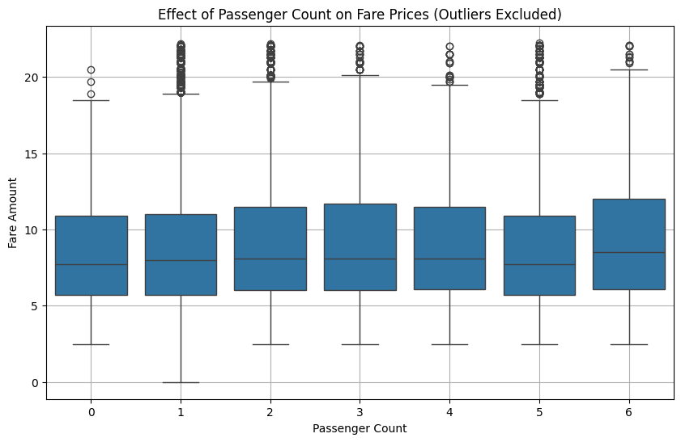

Fig 7. Effect of Passenger Count on Fare Prices. The number of passengers has very minimal effect on fare prices.

Perhaps the most interesting trait of the two datasets was the fact that they had several features in common, such as: pickup_datetime, pickup_longitude, pickup_latitude , dropoff_longitude , dropoff_latitude, and  passenger_count. This served as the spark behind our project, as we realized that we could merge these disparate datasets, and then make predictions on both duration and fare, with the hope that the additional features from merging the datasets would lead to more accurate predictions compared to making two separate models.

## Preprocessing

Merging the two datasets required several preprocessing steps. First, both datasets were reduced to exactly one million rows through random sampling. Next, extraneous features such as the vendor id, key, and store_and_fwd_flag were dropped. 

Then all pickup and dropoff longitude/latitude coordinates were rounded to three decimal places. The two datasets were then merged if they shared the same pickup and dropoff coordinates and passenger count:

```
# Merge duration and fare df on rounded coordinates
mergedDf = pd.merge(durationDfSampled, fareDfSampled, on=['pickup_longitude_rounded', 'pickup_latitude_rounded', 'dropoff_longitude_rounded', 'dropoff_latitude_rounded', 'passenger_count'], how='inner')
mergedDf.describe()
```
The number of decimal places that the coordinates were rounded to was determined through experimentation, since we had to balance retaining enough rows after the merge to meaningfully train models, while also having enough precision where there would still be some correlation between the coordinates and durations/fares. 

## Model 1

### Fare Prediction

We first tried the most basic regression model: linear regression. Our linear regression model included these features:

- pickup_longitude_rounded	
- pickup_latitude_rounded	
- dropoff_longitude_rounded	
- dropoff_latitude_rounded	
- passenger_count	
- trip_duration	
- fare_amount

The target variable was fare_amount. We split the dataset into 80% training and 20% testing sets using the sklearn.model_selection library. This was to ensure our model had enough data to learn off of, and enough testing data to ensure we could correctly evaluate the model. With a random state of 151, we were able to reproduce the data across many different machines, especially with a mostly asynchronous team. 

Seeing a relatively high error rate, we opted to try a Polynomial Regression model instead, with 2 degrees of freedom. We ended up using this as our final model 1. 

### Trip Duration Prediction

For predicting trip duration, we saw from our data exploration and preprocessing that there were many outliers. Taking a look at the data, we had these statistics on trip_duration:

| Metric | Value |
| ------ | ----- |
| Count | 126,473 rows |
| Mean | 767.48 seconds |
| STD | 5,578.71 seconds |
| Minimum | 1 second |
| 25th | Percentile 333.0 seconds |
| Median | 524.0 seconds |
| 75th | Percentile 828.0 seconds |
| Maximum | 1,763,934.0 seconds |

First, we limited the trip_duration column to rows with at least 120 seconds and no more than 1000 seconds. We found that this already captured most of the data, while removing much of the weird data. Specifically, we considered trips that were between 2 and 16.67 minutes. Next, we calculated the Manhattan distance between the latitude and longitude pairs, as cars in New York City would be likely to travel along a grid-like structure (which is why it is called Manhattan Distance). 

First, we used a Linear Regression model to see if we could get a good generalization. 

With a poor MSE, we then tried Polynomial Regression with 2 degrees of freedom. Some initial testing with more degrees did not necessarily decrease the MSE (and increase the R2 value).

## Model 2

Our second model focused on improving the predictions for both fare price and the trip duration. Firstly, to address the limitations of the previous models, we tried to implement a much more complex model, a neural network. Then, we built a decision tree when we realized this was not able to generalize to the data as well. 

### Fare Prediction

As before, we split the data to 80:20, train and test and used a set seed to ensure that we could reproduce the material. Then, we used StandardScaler() to ensure that our data was normalized so that the neural network could perform better on it. Here, we decided to use tensorflow since it contained the libraries needed to build this model. This was 
our model architecture: 

| Layer | Params |
| ----- | ------ |
|Hidden Layer 1 | 64 neurons, ReLU Activation |
|Hidden Layer 2 | 32 neurons, ReLU Activation |
|Output Layer 1 | neuron, Linear Activation |


We then used MSE as our loss function to penalize large prediction errors. Then, our optimizer was the Adam optimizer. The reason we used this was because it would adaptively change the learning rate while training to ensure the model could converge appropriately. Since we had a lot of features that represented different values, we found that this was more effective than SGD. 

Our learning rate was 0.001. This was because we found that too high learning rates would cause the optimizer to not be able to reach the global minima (or at least the local minima) in a reasonable amount of time (or quite frankly, ever). Additionally, because the Adam optimizer was able to change the learning rate dynamically, we recognized that setting the learning rate to a lower magnitude would allow the Adam optimizer to explore more options. 

We used a batch size of 32 so that the model could frequently update itself with new data each time. From previous experience, Kyle recognized that using a batch size that was a power of 2. We wanted to speed up the convergence also. We also used this because it was the standard for most models. 

Then, we used 110 epochs. This was kind of arbitrary since we were unsure how far we could get the model to train. We started from a low amount of epochs, then increased it by 10 until the model dropped in performance. 

### Trip Duration Prediction

For the trip duration, we wanted to try a neural network at first again. We had the same model as before, but properly fit to the input data. We also used MSE as it would again, penalize 

The big difference here was that we used a much smaller learning rate for the Adam optimizer, at 0.0001. This is because in initial testing, we found that the model would converge too quickly at any learning rate higher than this one. Additionally, we found that the data was much noisier as shown in the graph, so a small step size would ensure a smoother gradient update every iteration. We kept the same batch size as before. We also found that despite the number of epochs added, the model would not converge and showed no sign of decreasing the MSE. The R2 was extremely close to 0, so much in fact that during initial testing, some of our teammates had R2 values below 0, indicating that it was performing worse than a simple mean. 

On our second attempt, we tried a Decision Tree Regressor. We decided to do this because our trip duration models were not getting any remotely good results, so we had to try a new radical idea. The decision tree model was able to split the data based on feature values, allowing it to capture more of the data and create better non-linear relationships. In particular, we noticed that it was able to generalize better to the noise and variability of the data as opposed to a neural network.

We also did some feature engineering, specifically using the Haversine distance formula to determine the distance between two points on a sphere. We chose to do this because we found that the latitude and longitude values were too close to each other for the model to generalize to them. There was not enough variance between the points.

Then, we found that too much of the data was quite noisy, so we used the Interquartile Range to remove the outliers. Although this meant we would not be able to capture as much data, it meant that we would be able to make better predictions for a much larger amount of data. After this, we implemented sklearn's GridSearchCV to try and find the optimal tree hyperparameters. Below are the values we tried:

| Parameter | Value |
| --------- | ----- |
| max_depth | [5, 10, 15, 20] |
| min_samples_split | [2, 5, 10, 20] |
| min_samples_leaf | [1, 2, 5, 10] |


Our model found these values to be optimal: 

- max_depth = 5
- min_samples_split = 20
- min_samples_leaf = 1

These values made sense because the model did not need to be too complex as we had shown in our first neural network. The depth was chosen to be quite low and the minimum split would not go above 20 in this grid, ensuring we prevented overfitting to offset a simpler model. The last hyperparameter this GridSearch chose was the number of samples each leaf nodded needed. For some reason, it found that making the model more complex here was optimal. We were not sure why the model did this, but the results were undeniably better than the previous 3 models. 

# Results

## Model 1

### Fare Prediction

After running our polynomial regression model, we got these results:

| Metric | Value |
| ------ | ----- |
| Train MSE | 41.562368528526115 |
| Test MSE | 38.86696472516666 |
| R-squared | 0.782 |

### Trip Duration Prediction

After running our polynomial regression model, we got these results:

| Metric | Value |
| ------ | ----- |
| Train MSE | 29151.005060962114 |
| Test MSE | 29086.7998804891 |
| R-squared | 0.417 |

## Model 2

### Fare Prediction

For our fare price prediction, with our neural network, the best accuracy we got was as follows:

| Metric | Value |
| ------ | ----- |
| Train MSE | 8.618085784831779 |
| Test MSE | 9.399654295686593 |
| R-squared | 0.871 |

These results were quite significant, as had a much lower MSE, and a dramatically increased R2 value. This indicated that the model was getting very adept at generalizing to the data. However, we noticed that there was some slight overfitting as the Test MSE was higher than the Train MSE by ~10%. However, given the high R2 we found this acceptable. 

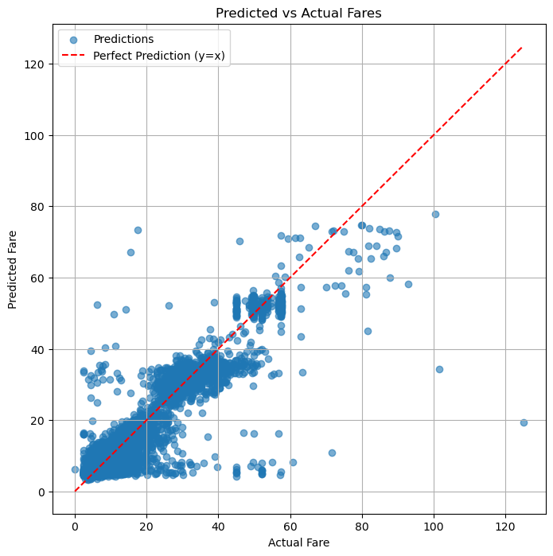

Fig 10.  Predicted vs. actual fare amounts for model 2, with the red line indicating perfect predictions. 

### Trip Duration Prediction

For our duration prediction, our neural network didn’t work well at all, with a R2 value of -0.005. So, we tried a decision tree model, which worked much better, with a result of:

| Metric | Value |
| Train MSE | 47754.42568249549 |
| Test MSE | 48118.06320689619 |
| R-squared | 0.472 |

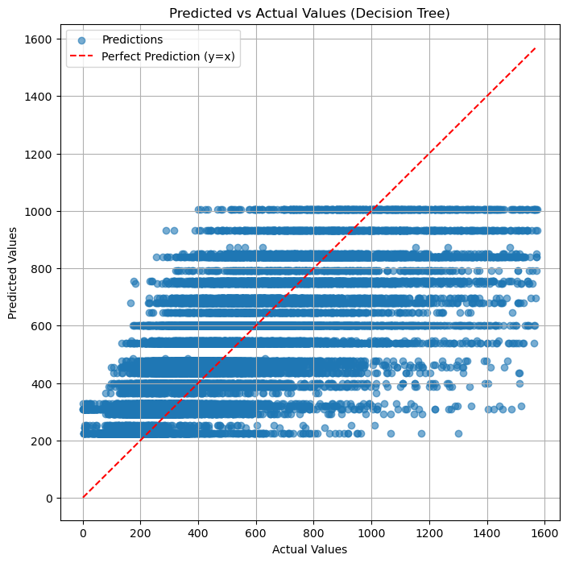

Fig 11.  Predicted vs. actual durations for model 2, with the red line indicating perfect predictions. 

# Discussion

## Model 1

### Fare Prediction

While our linear regression model captured some basic relationships, the relatively high error indicated that linear regression struggled with the complexity of the data. 

Our polynomial regression model had a better error rate and better R2 value, so given that, we saw that this was quite ideal. Also, we forgot to apply feature scaling and normalization, which would have increased model performance, especially for Linear Regression. There was also a lack of more nuanced features, such as weather conditions or time of day as taxi driver fares can change due to the length of trips in these conditions. This would have allowed us to capture more variability of the data. We did not consider any regularization techniques such as Ridge or Lasso regression because we believed our model was not overfitting. This was due to the fact we had a relatively high R2 value, but was not egregiously high.

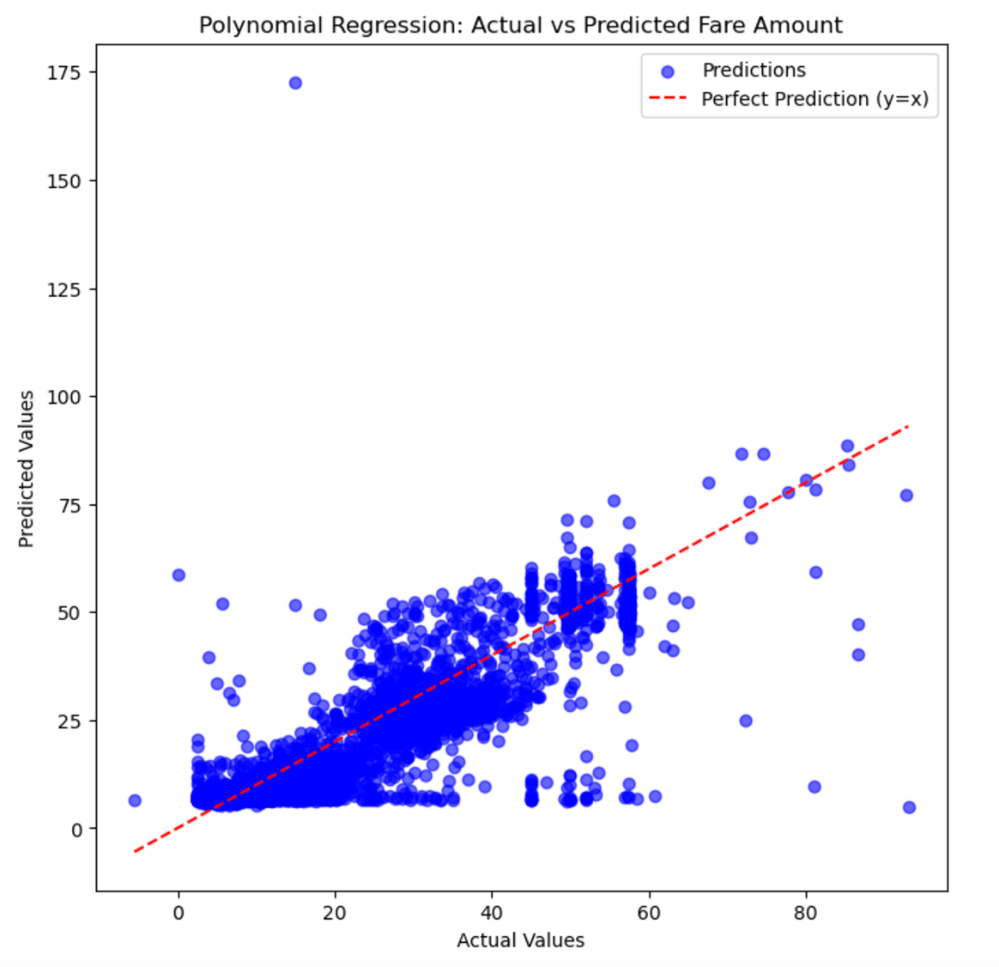

Fig 8.  Predicted vs. actual fare amounts for model 1, with the red line indicating perfect predictions. 

### Trip Duration Prediction

Our initial linear regression model had a really high error rate. After trying a polynomial regression model, we had a significant improvement, with a reduced MSE and an increased R2 value. 

However, despite the improvement, the model was nowhere near accurate enough. In particular, the model would sometimes guess impossible values, such as a negative trip duration or a duration under 30 seconds. Because of the model's output limitations, we realized that adding more degrees to the model would not necessarily increase the model's accuracy, so we had to use a different architecture to increase our R2 score. We were also worried about overfitting at this point as we noticed that increasing the degrees did not increase the accuracy. 

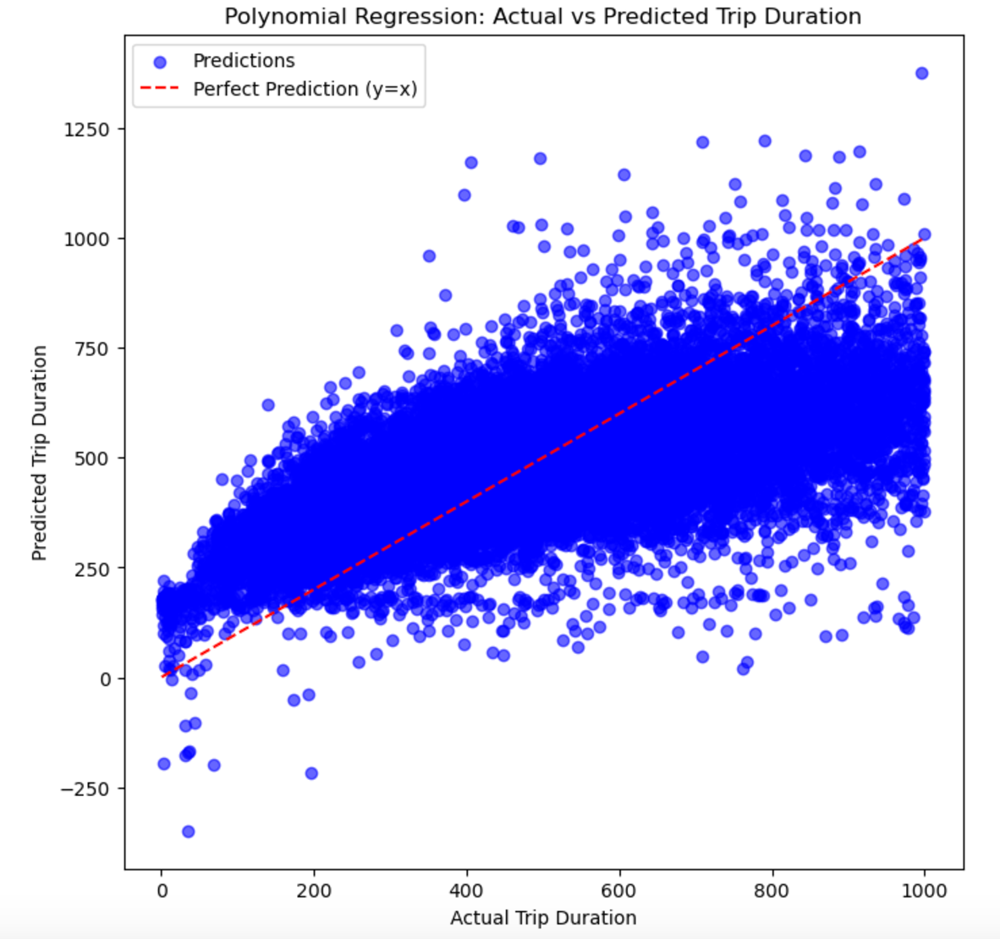

Fig 9.  Predicted vs. actual fare durations for model 1, with the red line indicating perfect predictions. 

## Model 2

### Fare Prediction

[TODO: add stuff here] 

### Trip Duration Prediction

With our decision tree, we found that despite using a more complex model with better fine tuning, this model did not perform significantly better than the Polynomial Regression model. However, we did manage to achieve about 0.06 more points in the R2 metric which is an improvement nonetheless. 

If we were to improve this, we would find more higher quality data, ideally with labels for date and time. Then, we would try more advanced models such as the XGBoost or even combine multiple trees. We would continue using hyperparameter tuning to ensure that we have the best possible model given the constraints. 

# Conclusion:

### Fare Prediction:

When predicting fare price, the neural network performed well, with a R2 value of 0.869. To improve our neural network, we could try to add some more layers. For now, it's a relatively simple neural network with only three dense layers. After adding more layers, we can add some dropout layers to ensure the model is able to propagate the loss properly through the model. We could also use a different optimizer, more high quality data, and more epochs. We also tried to do hyperparameter search to optimize the neural network, but we found that no matter what, we could not break the 0.869 R2 value. 

For our model, we opted to use 100k rows in an effort to avoid overfitting, so one thing we can try is changing the amount of data we use. Either using less rows, or using more rows and use regularization or dropout layers to avoid overfitting. 

Overall though, we’re pretty happy with the performance of this model. With the amount of noise that’s in our dataset, we know that achieving a 100% accuracy is generally unfeasible. Any way we change our model could have an adverse effect by causing overfitting. With our current model, we found that if we tried to train our neural network for more than 110 epochs, our model would overfit and the accuracy would actually get worse, so more isn’t always the best. 

### Trip Duration Prediction:

The duration model, on the other hand, was a much harder task. When we tried the same neural network as for the fare price calculation, we got a R2 value of -0.005, which is worse than just guessing the mean. We believe this is because duration has a lot of random factors which can affect it while fare is most likely determined by distance traveled and time of the day. We think the random factors which affect the duration could have included traffic, rush hour, large events, etc. We decided that a decision tree would have an easier time generalizing for these random factors, so we tried a decision tree, and achieved a much better R2 value of 0.472.

For our decision tree model, we can improve it by tuning hyperparameters like max_depth, min_samples_split, and min_samples_leaf. We also employed feature engineering, especially in the Haversine distance function which ensured that the distances actually were able to convert from geographical location to a measurable distance the model could understand. With better feature engineering and more high quality data, we can enhance its performance and better measure it with cross-validation.

Another improvement which we could have tried to improve our model would have been to use gradient boosting. This is because a gradient boosting would have used more than one tree to combine predictions and find more complex relationships in the data. Gradient boosting would theoretically work well with our data since it is better able to work with categorical and numeric data due to its ability to find the features which matter the most.

We were pretty disappointed with the results of the initial neural network, but when we switched to the decision tree model, we were much happier with the results. While a R2 value of 0.472 isn’t an extremely high value, we realized that the duration data has lots of noise within it, and that there isn’t a perfect correlation, so we’re pretty happy with the results. 

# Statement of Contribution

Aniket: Contributed to both data exploration and preprocessing. Wrote model 1 with Kyle and Rahul, and wrote model 2 with entire team. Wrote results and conclusion section of writeup, and reviewed entire final writeup.

Kyle:

Mahmoud:

Pranav: Setup code to import data from Kaggle into Google Collab as a pandas dataframe for data preprocessing. Found out what fitting graph meant on the intructions, and discussed with group on how to evaluate model based on fitting graph. Also made a discord post on it to get clarification from the professor (this may have also helped other groups out). Contributed the idea of using XGBoost for future improvements of our model. Wrote extensive portions of the model evaluation and fitting graph sections on the writeup for milestone 4, including the comparisons of the R2 score and MSE for the models.

Rahul: Worked on creating the plots for plotting the model results. Contributed to the data preprocessing; Attempted model tuning for Milestone 4.

Sammyo: Contributed to the data preprocessing and exploration. Revised writeup for Milestone 4 submission, and wrote Data Exploration and Preprocessing sections for final writeup.

# Past Submissions:

## Milestone 3

The conclusion of our first model was that:
    - Using a Polynomial Regression model was more accurate than a Linear Regression model. This is becasue we were able to make the model more complexy by increasing the complexity of our "function" on the graph.
    - Our model's R2 correlation coefficient is decent for predicting fare price, but terrible for duration. We are not sure why. We can probably increase the polynomial degree but that may overfit the model.
    - We can improve it with more data, and possibly rounding the latitude and longitude to more decimals to ensure that we have more accuracy.
    - We notes that the decimal rounding was already quite accurate, with each point about less than 1-2 mi between each point in a lattice.

### Notebooks:
- Preprocessing in preprocess.ipynb
- Model in model.ipynb

## Milestone 4 

### Methods

To improve our model from polynomial regression, we opted to create a ANN with three layers. 

#### Fare Price Calculation

For the fare model, we reduced our Test MSE from 15.43 (polynomial regression) to 9.571 (ANN), and we also increased our R-squared score from 0.782 (polynomial regression) to 0.869. 

#### Duration Calculation

For the duration model, we also tried a ANN, but our model performed poorly, with an R-squared value of close to 0. After further testing, we believe that a neural network is too complex of a model to accurately represent the duration prediction. So, we decided to try a decision tree model instead. A decision tree regressor splits the data into subsets based on feature values. This model worked much better, reducing our Test MSE to 48118, and increasing our R-squared value to 0.472. 

## Model Evaluation

For this milestone, we first implemented a neural network to predict the trip fare and duration, before implementing a decision tree model. The new decision tree model produced the largest improvement over our previous models . 

Our training versus test error for both the trip fare and trip duration prediction models has improved from the prior models we used. Initially with our first model, a Polynomial Regression model, our trip fare training data Mean Squared Error (MSE) was 14.398 and test data was 15.43, which is a 7.2% percent difference between the two. This indicates that our model generalized to the data relatively well, although with some signs of slight overfitting. With the newer neural network model applied, the train MSE lowered to 8.789 and the test MSE dropped to 9.571, which is a 8.9% difference between the two. The overall MSE had decreased, but at the cost of a larger difference between the training and test error due to an increase in model complexity. In addition, another metric we used to compare the regression models for trip fare is the R² score, or the coefficient of determination, which represents the proportion of the variance in the target of the model that is explained by the predictors in the model, and is used to evaluate how well the model fits the data. For the first model the R2 score was 0.782 and for the second model it was 0.869, which is a good improvement, as the highest possible R2 score is 1.0, and a higher R2 score means that our model explains the variance in possible taxi fare data better, with about 86.9% of variance in taxi fare data covered by our model. We hypothesize that achieving a higher R2 value would require a lot more data with many more features. In particular, time of day, weekday/weekend (Sunday, Monday, etc.) so that the model can generalize workdays, holidays, and other events that would cause traffic congestion. This in turn would require a more complex neural network.

For trip duration, with our first model (Polynomial Regression), our train data MSE was 32765.832 and our test data MSE was 32733.465, which is a  0.1% difference between the two, and the test MSE was lower than the train MSE, which might have been a result of underfitting. We noticed that our R2 value was very bad, and we struggled to create a new model that performed better.  We tried a Neural Network approach, similar to what we had implemented to predict the fares, but the results were poor (sometimes even having a negative R2 value). We decided that we had to create a more sophisticated model. 

After some iteration, we landed on a decision tree approach. Our new model resulted in a train data MSE of 47754.426 and a test data MSE of 48118.063, which is a 0.8% difference between the two. There was an increase in the difference between the train and test MSE due to an increase in the model complexity, but one aspect of our model’s performance improved significantly, the R2 score. The R2 score for the polynomial regression duration model was 0.343, while the R2 score for the Decision Tree model was 0.472, which is a significant improvement. These two metrics of MSE and R2 also apply to question 6 for evaluating our model performance, since we used a regression model instead of a classification model.

## Fitting Graph

Overall, our trip fare model has increased in model complexity, placing it further out on the fitting graph in terms of model complexity than the first model, but predictive error has also decreased, which lines up with the curve of the fitting graph. Since the difference in predictive error between the training and test data is relatively low at 8.9% and the overall predictive error of both training and test data is lower, the model’s complexity is just right and the model still falls within the ideal range for model complexity. Our trip duration model has also increased in model complexity and falls further out on the fitting graph than the first model, since it has progressed past the underfitting stage. The difference between the predictive error of the training and test data is quite low at 0.4%, but the predictive errors for each are still large values, which can definitely be improved further. This means that the model complexity needs to be increased, and the current model falls in the simple model section of the fitting graph, to the left of the ideal range of model complexity.

## Future Models to Try

The next model we are thinking of using is some kind of gradient boosting model, such as a XGBoost, since these types of models are good for handling data with lots of noise/outliers. We could also try using K-Nearest Neighbors - while this model is normally used for classification, a variation of it can also be used for regression, especially as the data has many dimensions that all contribute to how long a taxi ride can be. In particular, a KNN model might be able to generalize certain parts of NYC (with the latitude-longitude) as having more traffic and thus would have higher fares. In particular, the clusters can be intervals of trip duration, although this would imply that we would be trying to classify the duration and not necessarily predict a continuous value for the trip duration. One other issue we came across is that some of our models would predict a negative duration, which is impossible. We tried to use different activation functions in the Neural Network to try and eliminate this. In particular, we used the relu activation function in parts of the model to try and rectify this. We would also try a random forest model, which is similar to our decision tree model, but better at avoiding noise and outliers. A random forest model is also better at avoiding overfitting, something which decision trees can sometimes suffer from. Especially if we try to improve our model by obtaining data about more features, we could then use feature importance to prioritize features.

## Conclusion

**Fare:**

When predicting fare price, the neural network performed well, with a R2 value of 0.869. However, this neural network performed poorly when trying to predict trip duration, with an R2 value of -0.005, indicating that this model performed worse than just predicting the mean. We believe this was because the neural network was too simple to predict the duration we were looking for with the data we were using. We decided to explore other models for predicting duration for this reason. 
    
For our neural network, we could try to add some more layers. For now, it's a relatively simple neural network with only three dense layers. After adding more layers, we can add some dropout layers to ensure the model is able to propagate the loss properly through the model. We could also use a different optimizer, more high quality data, and more epochs.
We also tried to do hyperparameter search to optimize the neural network, but we found that no matter what, we could not break the 0.869 R2 value. We propose that higher quality data could be added, and that we could try to get more layers for the neural network to get it to generalize to the data better. One could argue that this might be the computational limit already as we will eventually asymptote and plateau performance as we approach 1.0, a theoretical perfect performance. Thus, we would get severe diminishing returns with more data, compute, and complexity.


**Duration:**

We found duration to be quite difficult to model. We believe this is because duration has a lot of random factors which can affect it while fare is most likely determined by distance travelled and time of the day. We think the random factors which affect the duration could have included traffic, rush hour, large events, etc. A decision tree would have an easier time generalizing for these random factors. As such, we tried a decision tree, and achieved a much better R2 value of 0.472.
    
For our decision tree model, we can improve it by tuning hyperparameters like max_depth, min_samples_split, and min_samples_leaf. We also employed feature engineering, especially in the Haversine distance function which ensured that the distances actually were able to convert from geographical location to a measurable distance the model could understand. With better feature engineering and more high quality data, we can enhance its performance and better measure it with cross-validation.

Another improvement which we could have tried to improve our model would have been to use gradient boosting. This is because a gradient boosting would have used more than one tree to combine predictions and find more complex relationships in the data. Gradient boosting would theoretically work well with our data since it is better able to work with categorical and numeric data due to its ability to find the features which matter the most.
